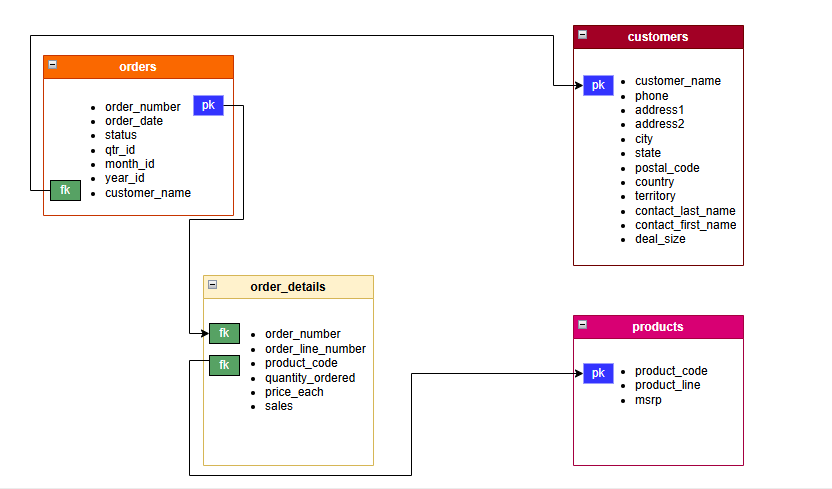

# Inventory_Management_SQL_Project
This project demonstrates advanced SQL analytics on a simulated Inventory Management dataset. I analyzed inventory performance, sales trends, stock risks, and restock prioritization using window functions, CTEs, and business-driven logic.

## 📊 Project Goals

- Analyze product sales and performance
- Detect inventory risks and stock trends
- Segment product lines by revenue contribution
- Build a Restock Prioritization Model

## 📁 Phases Included

### Phase 1 - Basic Queries
- Top-selling products
- Sales and estimated profit by product
- Monthly sales trend
- Order volume by status
- Top customers by spend

### Phase 2 - Inventory & Sales Insights
- Low-stock product detection
- Monthly sales trend by product line
- Average order size per product
- Bottom products by sales
- Region-based product performance

### Phase 3 - Strategic & Predictive Analytics
- Product sales seasonality
- Quarterly product line growth (with growth %)
- Underperforming product lines (2+ quarters consecutive declines)
- Category revenue contribution (% of yearly total)
- Restock Prioritization Model

## 🗂 Dataset

The dataset was gotten from Kaggle;
- [Sample Sales Data on Kaggle](https://www.kaggle.com/datasets/kyanyoga/sample-sales-data)

## 🗺️ Database Schema

I tried to draw up the database schema showing the relationship between the tables;

## 💻 Tools

- MySQL Workbench
- SQL Window Functions, Aggregations, CTEs, Advanced Grouping

## ⭐ Usage

- To see the results, run each phase in sequence to generate the insights.
- You can also dapt the Restock Model logic for your business needs.

## 👏 Credits

Project executed by [Akinola Micheal Iyinoluwa](https://github.com/Akinola-Iyin)

---

